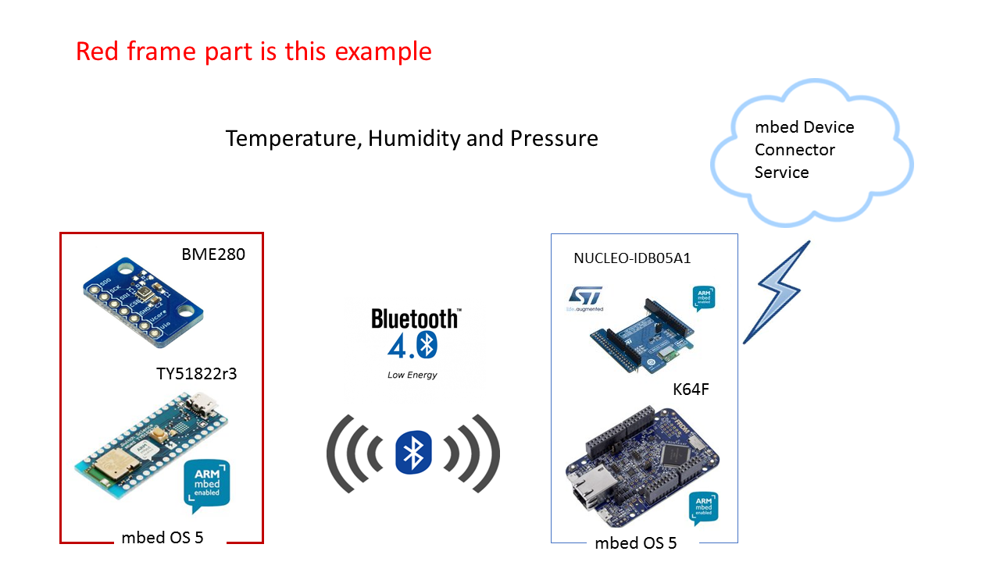

# BLE_Server_BME280
mbed application for BLE GATT server on TY51822r3 with a builtin BLE shield and wired Bosch BME280 sensor. it broadcasts measured value of temperature, humidity and pressure to BLE GATT client.

## Required hardware
* [TY51822r3 target platform] (https://developer.mbed.org/platforms/Switch-Science-mbed-TY51822r3/)
    
    It is a Bluetooth low energy development board with the Nordic's nRF51822 Rev.3 SoC.
    
    [Instractions for updating firmware] (https://developer.mbed.org/teams/Switch-Science/wiki/Firmware-Switch-Science-mbed-TY51822r3)

    [Latest firmware version] (https://developer.mbed.org/media/uploads/asagin/lpc11u35_sscity_if_crc.bin)

* [BME280 sensor] (https://developer.mbed.org/components/BME280-Combined-humidity-and-pressure-se/)
    
* Breadboard, wires, 2 registers (2.2k-ohm) and a USB cable.

## Wiring
BME280 uses I2C interface (SDI/SCK) to communicate with TY51822r3. please refer [a image wiring with Arduino Uno](http://trac.switch-science.com/attachment/wiki/BME280/s-BME280_12.jpg).
* SDI and SCK must be pulled-up by 2.2k-ohm registers.

* SDI wired to P0_30 (sda I2C0), SCK wired to P0_7 (scl I2C0)

## Required software
* [BME280 library] (https://developer.mbed.org/users/MACRUM/code/BME280/) made by Toyo. 

## Overview

Please find the BLE GATT Client application under https://github.com/soramame21/BLEClient_mbedDevConn repo.

You can verify the output of this application either:
  - on a serial terminal for your respective OS
  
    BME280 data are read and print every second.
    
    OR
  - on a BLE enabled Android device with the Nordic nRF connect app
  
    You can scan for the "BME280" device and "connect" to it. Upon successful discovery of services, you can enable "notifications" and start getting the sensor's data.
