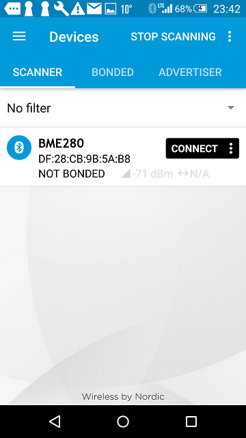
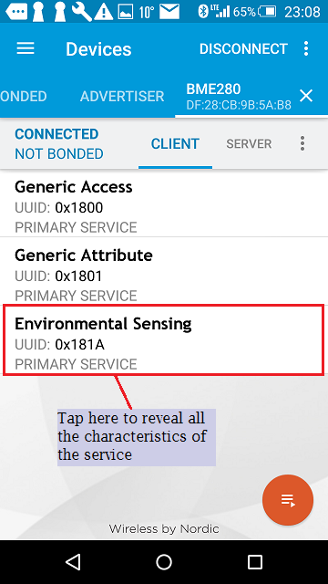
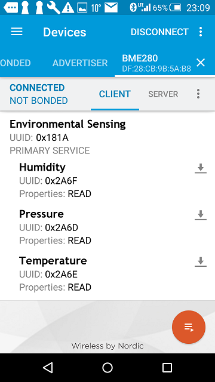
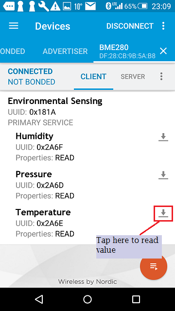

# BLE_Server_BME280
This mbed application for BLE GATT server running over TY51822r3 with a builtin BLE shield and wired Bosch BME280 sensor. It broadcasts measured value of temperature, humidity and pressure to BLE GATT client.

# Getting started with it on mbed OS

This is a very simple guide, reviewing the steps required to get BLE_Server_BME280 working on mbed OS platform.
Please install [mbed CLI](https://github.com/ARMmbed/mbed-cli#installing-mbed-cli).

## Get the example application!

From the command line, clone the example:

```
git clone https://github.com/soramame21/BLE_Server_BME280
cd BLE_Server_BME280
mbed deploy
```

### Now compile

Invoke `mbed compile` specifying the name of your platform and your favorite toolchain (`GCC_ARM`, `ARM`, `IAR`). For example, for the ARM Compiler 5:

```
mbed compile -m TY51822r3 -t ARM
```

Your PC may take a few minutes to compile your code. At the end you should get the following result:

```
[snip]
Link: BLE_Server_BME280
Elf2Bin: BLE_Server_BME280
+-----------------------+-------+-------+------+
| Module                | .text | .data | .bss |
+-----------------------+-------+-------+------+
| Misc                  | 17384 |    29 |  404 |
| drivers               |  1489 |     8 |   56 |
| features/FEATURE_BLE  | 12796 |    38 |  512 |
| hal                   |   558 |    16 |    0 |
| platform              |  1759 |     8 |   92 |
| rtos                  |   598 |     8 |    0 |
| rtos/rtx              |  6598 |   100 | 5036 |
| targets/TARGET_NORDIC | 23070 |   270 | 2423 |
| Subtotals             | 64252 |   477 | 8523 |
+-----------------------+-------+-------+------+
Allocated Heap: unknown
Allocated Stack: unknown
Total Static RAM memory (data + bss): 9000 bytes
Total RAM memory (data + bss + heap + stack): 9000 bytes
Total Flash memory (text + data + misc): 64729 bytes

Image: .\BUILD\TY51822r3\ARM\BLE_Server_BME280.hex
```

### Program your board

1. Connect your mbed device to the computer over USB.
1. Copy the binary file to the mbed device .
1. Press the reset button to start the program.

You can verify the output of this application either:
  - on a serial terminal for your respective OS

    BME280 data are read and print every second.

    OR
  - on a BLE enabled Android device with the Nordic nRF connect app

    You can scan for the "BME280" device and "connect" to it. Upon successful discovery of services, you can enable "notifications" and start getting the sensor's data.


Congratulations if you managed to complete this test!

### Monitoring the application
The application prints debug messages over the serial port, so you can monitor its activity with a serial terminal emulator. Start the [serial terminal emulator](https://developer.mbed.org/handbook/Terminals) and connect to the [virtual serial port](https://developer.mbed.org/handbook/SerialPC#host-interface-and-terminal-applications)
presented by TY51822r3. Use the following settings:

* 9600 baud.
* 8N1
* No flow control

After pressing the **RESET** button on the board, you should be able to observe the application's output as following.

```
Inside BLE..starting payload creation..
ble.gap().startAdvertising() => 0
1004.25 hPa,  25.64 degC,  24.64 %
1004.28 hPa,  25.64 degC,  24.64 %
1004.25 hPa,  25.64 degC,  24.66 %
1004.30 hPa,  25.64 degC,  24.61 %
```

### Discoverying from `nRF Connect`
This is a free Nordic App can be downloaeded into smartphone.

**Note:** Screens captures depicted below show what is expected from this example if the scanner used is nRF Master Control Panel version 4.9.0. If you encounter any difficulties consider trying another scanner or another version of nRF Master Control Panel. Alternative scanners may require reference to their manuals.

1. Build and install this application on your board (=mbed device) as explained above.
1. Open the BLE scanner on your phone.
1. Start a scan, then find the device which should be named `BME280`

    

    **figure 1** Scaning result nRF Master Control Panel 4.9.0

1. Establish a connection with your device.

    

    **figure 2** How to establish a connection using nRF Master Control Panel 4.9.0

1. Discover the service which has the UUID 0x181A

    

    **figure 3** Representation of Environmental Sensing service

1. Discover 3 characteristics of the service.

  Humidity with UUID: 0x2A6F

  Pressure with UUID: 0x2A6D

  Temperature with UUID: 0x2A6E

    

    **figure 4** Representation of 3 characteristics

1. Read sensor value

    

    **figure 5** How to read a value

    present temperature value

    

    **figure 6** presentation of temperature value


## Required hardware
* [TY51822r3 target platform](https://developer.mbed.org/platforms/Switch-Science-mbed-TY51822r3/)

    It is a Bluetooth low energy development board with the Nordic's nRF51822 Rev.3 SoC.

    [Instractions for updating firmware](https://developer.mbed.org/teams/Switch-Science/wiki/Firmware-Switch-Science-mbed-TY51822r3)

    [Latest firmware version](https://developer.mbed.org/media/uploads/asagin/lpc11u35_sscity_if_crc.bin)

* [BME280 sensor](https://developer.mbed.org/components/BME280-Combined-humidity-and-pressure-se/)

* Breadboard, wires, 2 registers (2.2k-ohm) and a USB cable.

## Wiring
BME280 uses I2C interface (SDI/SCK) to communicate with TY51822r3. please refer following table about paired pin wiring between BME280 and TY51822r3.


  | BME280 Pin   | TY51822r3 Pin   |
  |--------------|-----------------|
  |  1  SDO      |      GND        |
  |  2  SCK      |  P0_7 scl I2C0  |
  |  3  SDI      | P0_30 sda I2C0  |
  |  4  CSB      |      VDD        |
  |  5  GND      |      GND        |
  |  6  Vcore    |      VDD        |
  |  7  Vio      |      VDD        |


* SDI and SCK must be pulled-up by 2.2k-ohm registers.


## Overview


Please find the BLE GATT Client application under https://github.com/soramame21/BLEClient_mbedDevConn repo.
