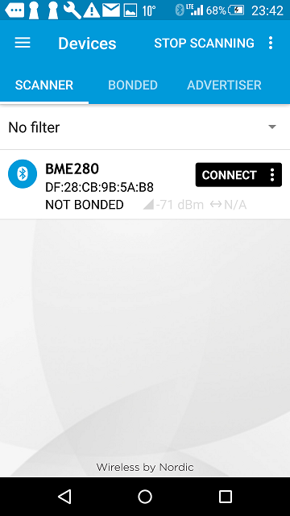
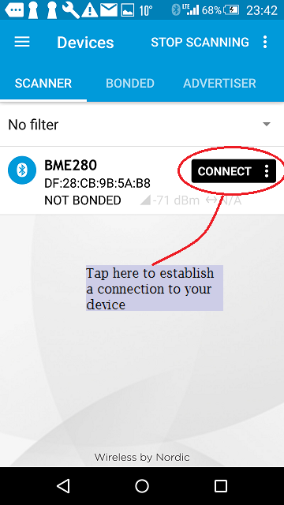
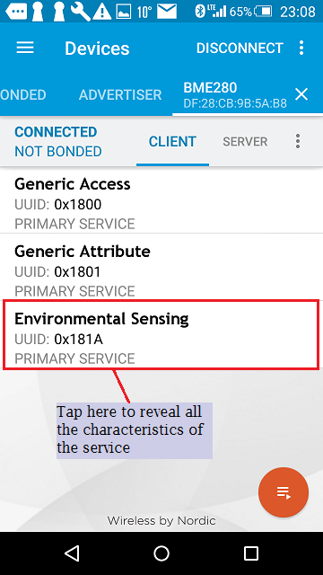
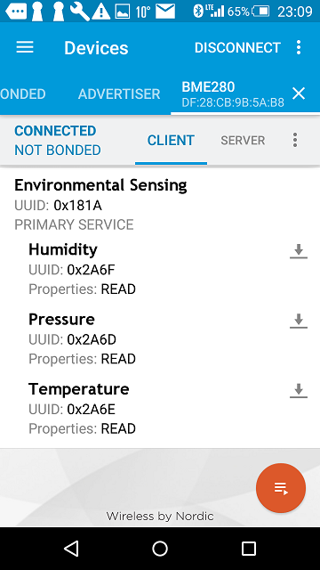
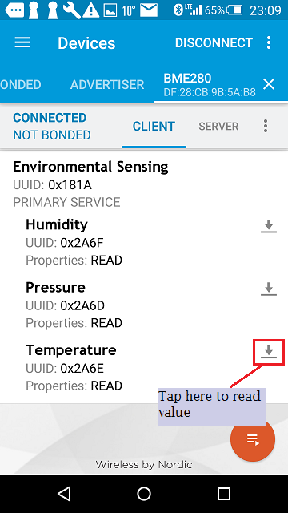
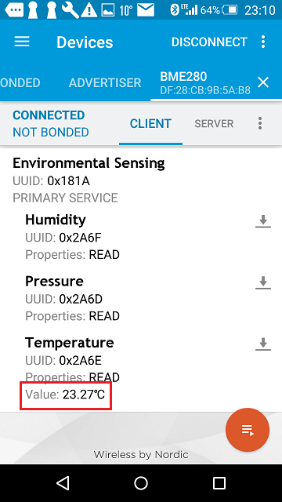

## Discoverying BME280 from `nRF Connect`
`nRF Connect` is a free Nordic App can be downloaeded and installed on smartphone.

**Note:** Screens captures depicted below show what is expected from this example if the scanner used is nRF Master Control Panel version 4.9.0. If you encounter any difficulties consider trying another scanner or another version of nRF Master Control Panel. Alternative scanners may require reference to their manuals.

1. Build and install this application on your board (=mbed device) as explained above.
1. Open the BLE scanner on your phone.
1. Start a scan, then find the device which should be named `BME280`

    

    **figure 1** Scaning result nRF Master Control Panel 4.9.0

1. Establish a connection with your device.

    

    **figure 2** How to establish a connection using nRF Master Control Panel 4.9.0

1. Discover the service which has the UUID 0x181A

    

    **figure 3** Representation of Environmental Sensing service

1. Discover 3 characteristics of the service.

  Humidity with UUID: 0x2A6F

  Pressure with UUID: 0x2A6D

  Temperature with UUID: 0x2A6E

    

    **figure 4** Representation of 3 characteristics

1. Read sensor value

    

    **figure 5** How to read a value

    present temperature value

    

    **figure 6** presentation of temperature value
